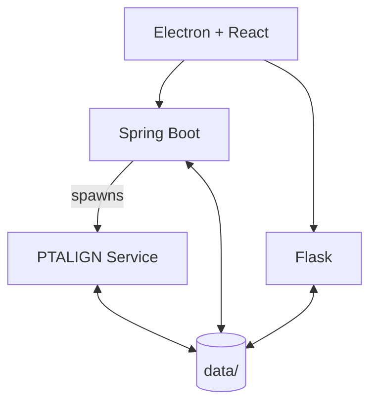

# ccBenchmarkTool

A desktop application for conformance checking benchmarks in process mining. Built as part of my thesis to measure alignment performance (time, memory, fitness) across different algorithms and optimization strategies.

## System Architecture

| Component | Port | Purpose |
|-----------|------|---------|
| Spring Boot | 8080 | Benchmark orchestration, alignment execution |
| Flask | 5000 | Trace variant clustering |
| PTALIGN | 5001+ | Process tree alignment via Gurobi (managed by Spring Boot) |

All backends expose REST APIs and can be operated independently via HTTP requests.

## Quick Start

For building images and detailed setup, see the [Getting Started Guide](docs/getting-started.md).

### Manual Setup

Each component has its own README with setup instructions:

- [Spring Boot Backend](./backend-springboot/README.md)
- [Flask Clustering](./backend-flask/README.md)
- [Alignment Service](./backend-alignment/README.md)
- [Electron Frontend](./frontend-electron/README.md)

## Documentation

- [Architecture Overview](docs/architecture.md)
- [API Reference](docs/api-reference.md)
- [Getting Started](docs/getting-started.md)

### Component Details

- [backend-springboot](docs/components/backend-springboot.md)
- [backend-flask](docs/components/backend-flask.md)
- [backend-alignment](docs/components/backend-alignment.md)
- [frontend-electron](docs/components/frontend-electron.md)

## Supported Algorithms

| Algorithm | Model Type | Implementation |
|-----------|------------|----------------|
| ILP | Petri Net (.pnml) | Java via ProM |
| SplitPoint | Petri Net (.pnml) | Java via ProM |
| PTALIGN | Process Tree (.ptml) | Python with Gurobi |