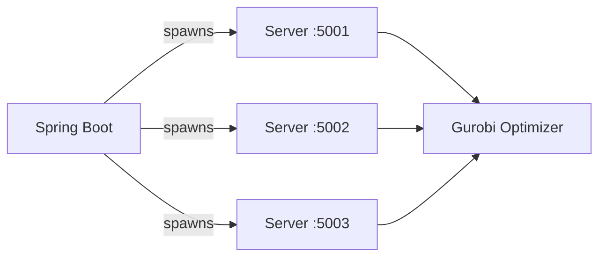
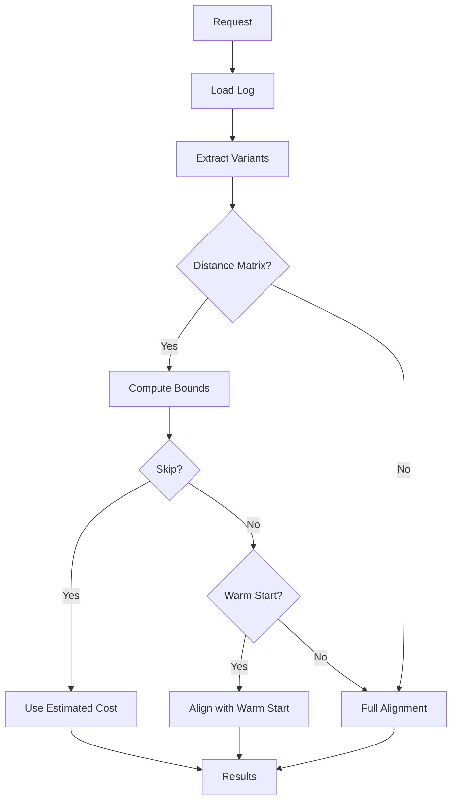

# Backend: PTALIGN Alignment Service

Python service for process tree alignment using Gurobi optimization. This service is spawned and managed by the Spring Boot backend.

## Overview

| Property | Value |
|----------|-------|
| Port | 5001+ (one per thread) |
| Base URL | `http://localhost:5001` |
| Purpose | Compute optimal trace alignments against process trees |

## Architecture



Spring Boot spawns one alignment server per thread. Each server:
1. Loads the process tree model once
2. Handles alignment requests via HTTP
3. Uses Gurobi to solve the optimization problem

## Project Structure

```
backend-alignment/
└── process-tree-alignment/
    ├── alignment_server.py          # Flask HTTP API (entry point)
    ├── alignment_logic.py           # Orchestration, warm start, bounds
    ├── process_tree_alignment_opt.py # Gurobi optimization (core algorithm)
    ├── process_tree_graph.py        # Process tree to graph conversion
    ├── bounds.py                    # Lower/upper bound computation
    ├── distance_matrix.py           # Levenshtein distance handling
    ├── edit_operations.py           # Alignment transformation for warm start
    └── models.py                    # Data classes
```

## How It Works

### Algorithm Overview

The alignment problem is formulated as a minimum-cost flow problem and solved using Gurobi:

1. **Process tree to graph** - Convert the .ptml model into a flow network (`ProcessTreeGraph`)
2. **Trace alignment** - For each trace variant, find the minimum-cost path through the graph
3. **Cost computation** - Cost = number of deviations (log moves + model moves)
4. **Fitness** - `fitness = 1 - (cost / (trace_length + cost))`

### Optimization Strategies

The service implements several optimizations to reduce computation time:

| Strategy | Description |
|----------|-------------|
| **Warm Start** | Use a similar trace's alignment as starting point for Gurobi |
| **Bounds** | Compute lower/upper bounds from known alignments using distance matrix |
| **Bounded Skip** | Skip alignment if bounds are tight enough (gap <= threshold) |
| **Cross-cluster** | Reuse alignment costs across clustered logs |

### Request Flow



## Key Files

### alignment_server.py

Flask HTTP entry point. Endpoints:
- `POST /load-model` - Load process tree and build graph
- `POST /align` - Align a log file
- `GET /health` - Health check

### alignment_logic.py

Main orchestration:
- `align_variants()` - Main loop over all variants
- `select_reference_traces()` - Pick initial traces to align without warm start
- `find_best_reference()` - Find closest known alignment for warm start
- `align_trace_full()` - Alignment without warm start
- `align_trace_warm_start()` - Alignment with warm start

### process_tree_alignment_opt.py

Core Gurobi optimization (from thesis advisor's implementation):
- `align()` - Entry point, sets up Gurobi environment
- `align_multithreaded()` - Builds and solves the ILP model
- `insert_move()` / `delete_move()` - Transform alignments for warm start

### process_tree_graph.py

Converts pm4py ProcessTree to a flow network:
- Handles sequence, XOR, parallel, and loop operators
- Computes edge capacities and costs

## Configuration Parameters

| Parameter | Default | Description |
|-----------|---------|-------------|
| `use_bounds` | true | Enable lower/upper bound computation |
| `use_warm_start` | true | Enable warm starting from similar traces |
| `bound_threshold` | 1.0 | Max gap to skip alignment |
| `bounded_skip_strategy` | "upper" | How to estimate cost when skipping: upper, lower, average |

## Integration with Spring Boot

The Spring Boot backend manages these servers via:

| Class | Purpose |
|-------|---------|
| `PythonServerManager` | Start/stop Python processes |
| `AlignmentClient` | HTTP requests to alignment servers |
| `ResponseParser` | Parse JSON responses into `AlignmentResult` |

See [backend-springboot.md](./backend-springboot.md) for details.

## Setup

See [backend-alignment/README.md](../../backend-alignment/README.md) for installation instructions.

### Gurobi License

Requires a valid Gurobi license. Academic licenses are free:
1. Register at [gurobi.com](https://www.gurobi.com/academia/academic-program-and-licenses/)
2. Download and install Gurobi
3. Run `grbgetkey <license-key>` to activate