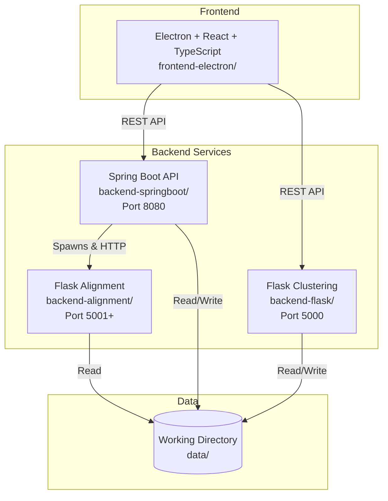
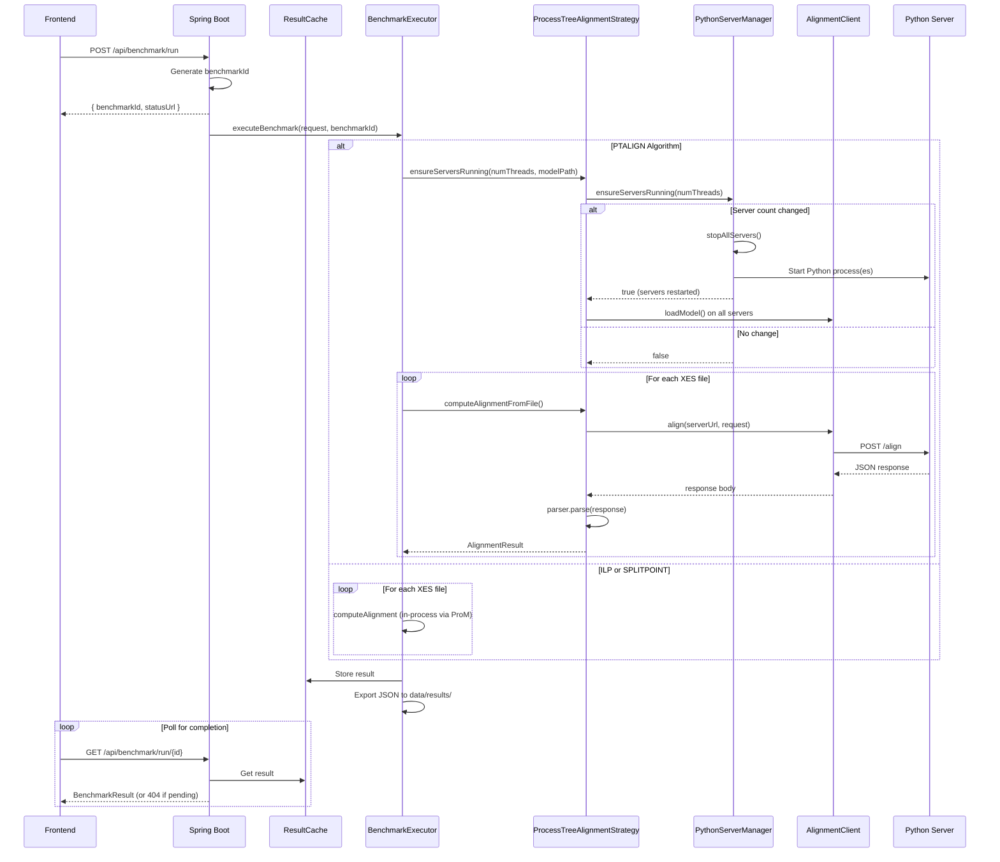
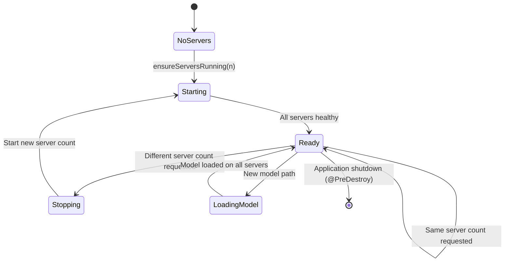
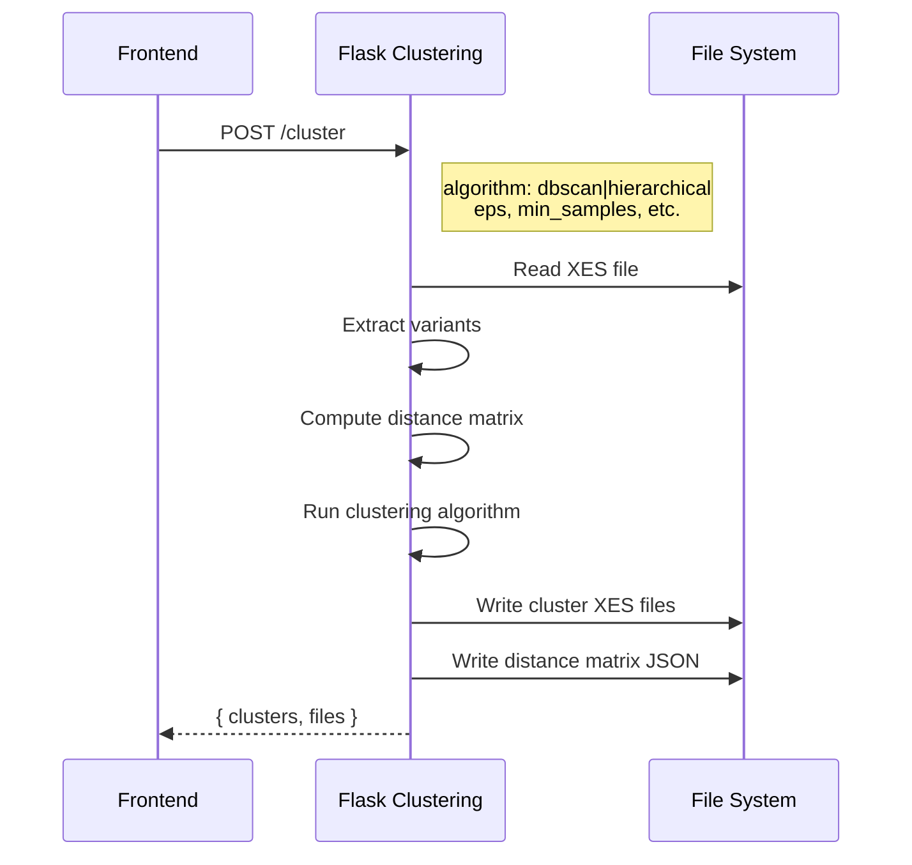

# ccBenchmarkTool Architecture

## Overview

ccBenchmarkTool is a desktop application for conformance checking benchmarks in process mining. It measures time and memory usage for alignments. Fitness is used as a quality measure. Using optimization techniques can lead to fitness loss.

## System Components



## Directory Structure

```
ccBenchmarkTool/
├── backend-springboot/          # Java REST API
│   ├── src/main/java/com/benchmarktool/api/
│   │   ├── config/              # Spring configuration
│   │   ├── controller/          # REST endpoints
│   │   ├── model/               # DTOs
│   │   ├── service/             # Business logic
│   │   └── util/
│   │       ├── strategy/        # Alignment algorithms
│   │       │   ├── ptalign/     # PTALIGN helper classes
│   │       │   └── ...
│   │       └── ...              # ProM utilities
│   ├── build.gradle
│   └── gradlew.bat
│
├── backend-alignment/           # Python PTALIGN service
│   ├── venv/                    # Python virtual environment
│   ├── process-tree-alignment/  # Alignment modules
│   │   ├── alignment_server.py  # Flask server
│   │   ├── alignment_logic.py   # Core algorithm
│   │   ├── process_tree_alignment_opt.py  # Gurobi optimization
│   │   └── ...
│   ├── requirements.txt
│   └── .gitignore
│
├── backend-flask/               # Python clustering service
│   └── ...
│
├── frontend-electron/           # Desktop UI
│   └── ...
│
├── data/                        # Working directory (user files)
│   └── {timestamp}_data/
│       ├── Model.pnml
│       ├── Model.ptml
│       ├── EventLog.xes
│       ├── distance_matrix/
│       └── results/
│
├── docs/                        # Documentation
│   ├── architecture.md
│   ├── api-reference.md
│   └── developer-guide.md
│
├── docker-compose.yml
├── .gitignore
└── README.md
```

## Component Responsibilities

| Component | Technology | Purpose |
|-----------|------------|---------|
| **frontend-electron** | Electron + React + TypeScript | File management, configuration UI, results visualization |
| **backend-springboot** | Java 21 + Spring Boot 3 | Benchmark orchestration, ILP/SplitPoint alignment, result export |
| **backend-flask** | Python + Flask | Trace variant clustering (DBSCAN, Hierarchical) |
| **backend-alignment** | Python + Flask + Gurobi | Process tree alignment (PTALIGN) with warm start optimization |

## Alignment Algorithms

| Algorithm | Model Type | Implementation | Description |
|-----------|------------|----------------|-------------|
| **ILP** | Petri Net (.pnml) | Java (ProM) | Integer Linear Programming - optimal but slower |
| **SPLITPOINT** | Petri Net (.pnml) | Java (ProM) | Split-point heuristic - faster approximation |
| **PTALIGN** | Process Tree (.ptml) | Python (Gurobi) | Warm start + bounds optimization - fastest for large logs |

---

## Key Workflows

### 1. Benchmark Execution Flow



### 2. PTALIGN Server Management



### 3. Clustering Flow



---

## Data Flow

### Input Files

```
data/
└── {timestamp}_data/
    ├── Model.pnml              # Petri net model
    ├── Model.ptml              # Process tree model
    ├── EventLog.xes            # Original event log
    └── clusters/               # After clustering
        ├── EventLog_cluster_0.xes
        ├── EventLog_cluster_1.xes
        └── ...
```

### Output Files

```
data/
└── {timestamp}_data/
    ├── distance_matrix/
    │   └── EventLog_distance_nosub.json
    └── results/
        └── benchmark_{id}_{algo}_{model}_{log}.json
```

### Result JSON Structure

```json
{
  "benchmark_id": "a8129b9d-65cd-44c2-bcdd-21b14857cca5",
  "algorithm": "PTALIGN",
  "model_file": "Model.ptml",
  "log_name": "EventLog",
  "num_threads": 4,
  "timestamp": "20260215_145300",
  
  "summary": {
    "avg_fitness": 0.9234,
    "avg_cost": 2.45,
    "successful_alignments": 846,
    "failed_alignments": 0,
    "total_traces": 1050,
    "total_variants": 215,
    "total_logs_processed": 5,
    "total_execution_time_ms": 45230,
    "total_compute_time_ms": 38500,
    "peak_memory_mb": 512
  },
  
  "ptalign_config": {
    "use_bounds": true,
    "use_warm_start": true,
    "bound_threshold": 1.0,
    "bounded_skip_strategy": "upper",
    "propagate_costs": false
  },
  
  "logs": {
    "EventLog_cluster_0": {
      "total_traces": 210,
      "total_variants": 45,
      "avg_fitness": 0.9456,
      "timing": { ... },
      "optimization_stats": { ... },
      "alignments": [ ... ],
      "bounds_progression": [ ... ],
      "global_bounds_progression": [ ... ]
    }
  }
}
```

---

## Spring Boot Package Structure

```
com.benchmarktool.api/
├── BenchmarkApplication.java           # Entry point
├── config/
│   └── CorsConfig.java                 # CORS settings
├── controller/
│   └── Benchmarkingcontroller.java     # REST endpoints
├── model/
│   ├── BenchmarkRequest.java           # Input DTO
│   ├── BenchmarkResult.java            # Output DTO
│   ├── BenchmarkRunResponse.java       # Async response
│   ├── LogBenchmarkResult.java         # Per-log result
│   └── ...
├── service/
│   ├── BenchmarkExecutor.java          # Orchestration
│   ├── BenchmarkResultExporter.java    # JSON export
│   ├── BenchmarkService.java           # Service layer
│   └── ResultCache.java                # In-memory cache
└── util/
    ├── PathResolver.java               # Path resolution
    ├── PNLoader.java                   # Petri net loading
    ├── XESLoader.java                  # Event log loading
    ├── AlignmentComputationMWE.java    # ProM alignment core
    ├── DummyConnectionManager.java     # ProM headless support
    ├── DummyConsolePluginContext.java  # ProM headless support
    └── strategy/
        ├── AlignmentStrategy.java          # Strategy interface
        ├── AlignmentStrategyRegistry.java  # Auto-discovery
        ├── ILPAlignmentStrategy.java       # ILP implementation
        ├── SplitPointAlignmentStrategy.java # SplitPoint implementation
        ├── ProcessTreeAlignmentStrategy.java # PTALIGN (delegates to ptalign/)
        ├── AlignmentInput.java             # Strategy input
        ├── AlignmentResult.java            # Strategy output
        ├── ModelType.java                  # PETRI_NET / PROCESS_TREE
        ├── TimingBreakdown.java            # Timing details
        ├── TraceAlignmentDetail.java       # Per-variant details
        ├── PromResultConverter.java        # ProM result conversion
        └── ptalign/
            ├── PythonServerManager.java    # Server lifecycle
            ├── AlignmentClient.java        # HTTP communication
            └── ResponseParser.java         # JSON parsing
```

---

## Configuration

### Spring Boot (application.properties)

```properties
server.port=8080
server.servlet.context-path=/api
benchmark.data.directory=../data

logging.level.com.benchmarktool=DEBUG
```

### PTALIGN Options

| Option | Type | Default | Description |
|--------|------|---------|-------------|
| `useBounds` | boolean | `true` | Enable bounds computation for skipping |
| `useWarmStart` | boolean | `true` | Use reference alignments as starting point |
| `boundThreshold` | double | `1.0` | Gap threshold for bounded skip |
| `boundedSkipStrategy` | string | `"upper"` | Cost estimation: `lower`, `midpoint`, `upper` |
| `propagateCostsAcrossClusters` | boolean | `false` | Share costs across cluster files |

---

## Port Allocation

| Service | Port | Notes |
|---------|------|-------|
| Spring Boot API | 8080 | Main REST API, context path `/api` |
| Flask Clustering | 5000 | Single instance |
| Python Alignment | 5001+ | One per thread (5001, 5002, ..., max 16) |
| Vite Dev Server | 5173 | Frontend development |

---

## Starting the Application

### Development Mode

```bash
# Terminal 1: Spring Boot (auto-starts Python servers as needed)
cd backend-springboot
./gradlew bootRun

# Terminal 2: Frontend
cd frontend-electron
npm run dev

# Terminal 3 (optional): Flask clustering
cd backend-flask
python app.py
```

### Manual Python Server (for debugging)

```bash
cd backend-alignment
.\venv\Scripts\Activate.ps1
python process-tree-alignment/alignment_server.py --port 5001
```