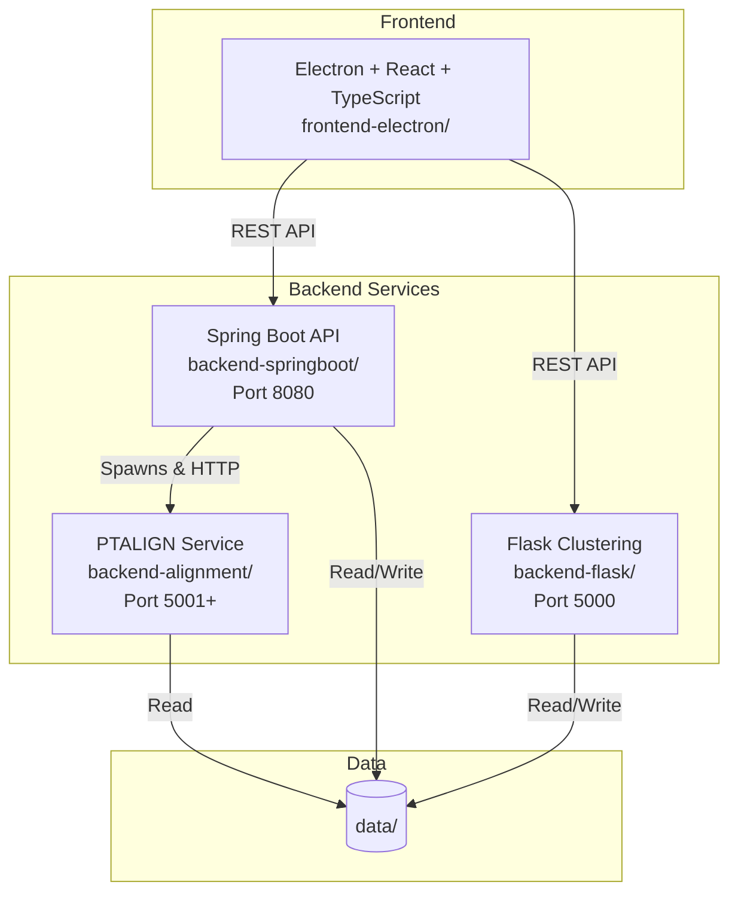
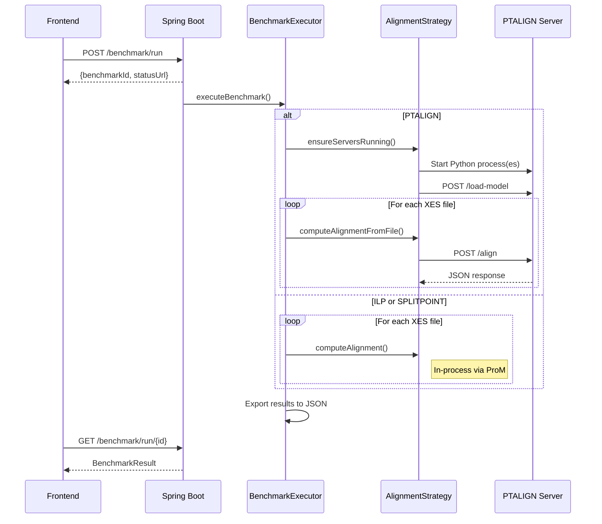
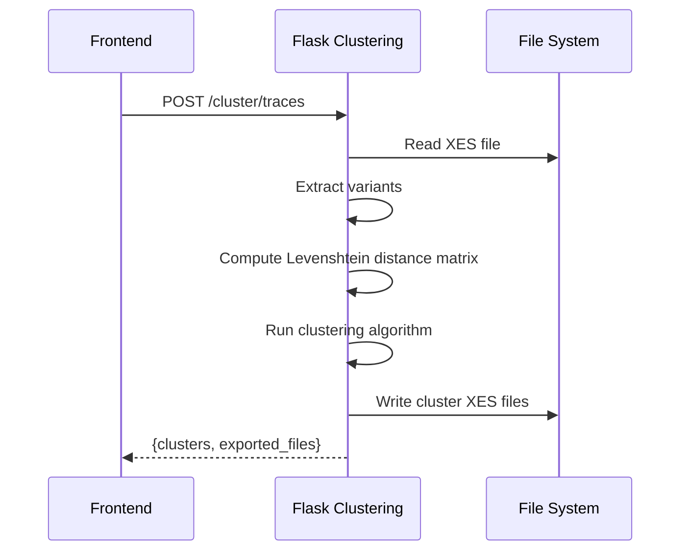
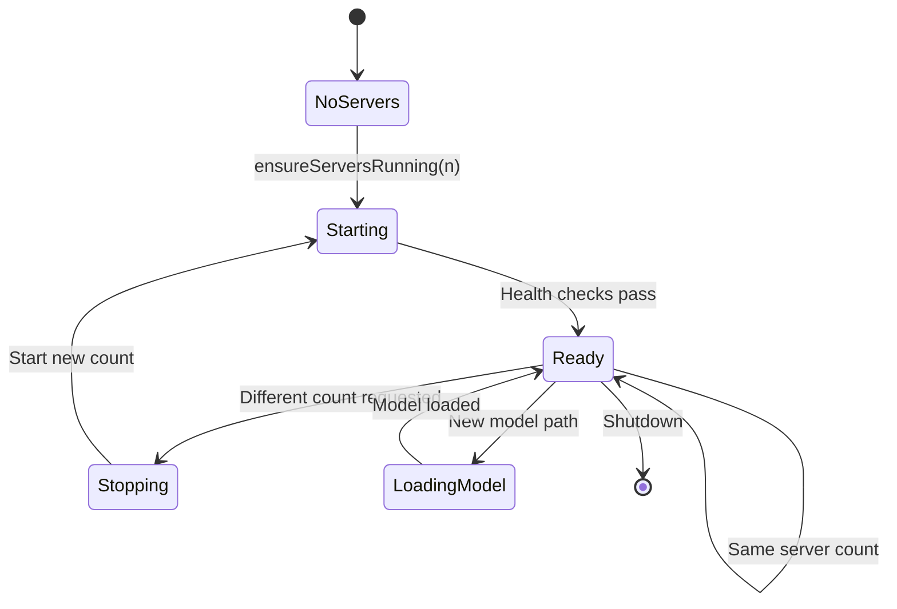

# ccBenchmarkTool Architecture

## Overview

ccBenchmarkTool is a desktop application for conformance checking benchmarks in process mining. It measures time and memory usage for alignments. Fitness is used as a quality measure.

## System Components



## Component Responsibilities

| Component | Technology | Purpose |
|-----------|------------|---------|
| **frontend-electron** | Electron + React + TypeScript | File management, configuration UI, results visualization |
| **backend-springboot** | Java 21 + Spring Boot 3 | Benchmark orchestration, ILP/SplitPoint alignment, result export |
| **backend-flask** | Python + Flask | Trace variant clustering (DBSCAN, Hierarchical) |
| **backend-alignment** | Python + Flask + Gurobi | Process tree alignment (PTALIGN) with warm start optimization |

## Alignment Algorithms

| Algorithm | Model Type | Implementation | Description |
|-----------|------------|----------------|-------------|
| **ILP** | Petri Net (.pnml) | Java (ProM) | Integer Linear Programming - optimal but slower |
| **SPLITPOINT** | Petri Net (.pnml) | Java (ProM) | Split-point heuristic - faster approximation |
| **PTALIGN** | Process Tree (.ptml) | Python (Gurobi) | Warm start + bounds optimization |

---

## Key Workflows

### Benchmark Execution



### Clustering Flow



### PTALIGN Server Lifecycle



---

## Data Flow

### Input Files

```
data/{timestamp}_data/
├── Model.pnml              # Petri net model
├── Model.ptml              # Process tree model
└─��� EventLog.xes            # Original event log
```

### After Clustering

```
data/{timestamp}_data/
├── EventLog_hierarchical_{timestamp}_clusters/
│   ├── cluster_0.xes
│   ├── cluster_1.xes
│   └── cluster_2.xes
└── distance_matrix/
    └── EventLog_distance_nosub.json
```

### After Benchmark

```
data/{timestamp}_data/
└── results/
    └── benchmark_{id}_{algo}_{model}_{log}.json
```

---

## Port Allocation

| Service | Port | Notes |
|---------|------|-------|
| Spring Boot API | 8080 | Context path `/api` |
| Flask Clustering | 5000 | Single instance |
| PTALIGN Servers | 5001+ | One per thread (max 16) |
| Vite Dev Server | 5173 | Frontend development |

---

## Configuration

### Spring Boot

`backend-springboot/src/main/resources/application.properties`:

```properties
server.port=8080
server.servlet.context-path=/api
benchmark.data.directory=../data
```

### PTALIGN Options

| Option | Default | Description |
|--------|---------|-------------|
| `useBounds` | true | Enable bounds computation |
| `useWarmStart` | true | Use reference alignments |
| `boundThreshold` | 1.0 | Gap threshold for skipping |
| `boundedSkipStrategy` | "upper" | Cost estimation strategy |
| `propagateCostsAcrossClusters` | false | Share costs across clusters |

---

## Starting the Application

### Development

```bash
# Terminal 1: Spring Boot
cd backend-springboot
./gradlew bootRun

# Terminal 2: Frontend
cd frontend-electron
npm run dev

# Terminal 3 (optional): Flask clustering
cd backend-flask
python app.py
```

### Docker

```bash
docker-compose up
```

---

## Further Reading

- [API Reference](api-reference.md) - All endpoints and data types
- [Developer Guide](developer-guide.md) - Quick reference
- Component docs:
  - [backend-springboot](components/backend-springboot.md)
  - [backend-alignment](components/backend-alignment.md)
  - [backend-flask](components/backend-flask.md)