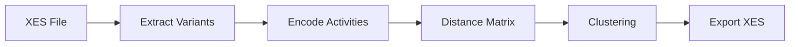

# Backend Flask - Clustering Service

Python REST API for trace variant clustering.

## Overview

| Property | Value |
|----------|-------|
| Port | 5000 |
| Base URL | `http://localhost:5000/api` |
| Purpose | Cluster trace variants from XES event logs |

## Project Structure

```
backend-flask/
├── app/
│   ├── controllers/
│   │   └── clustering_controller.py   # HTTP endpoint
│   ├── services/
│   │   └── pipeline_service.py        # Orchestrates the clustering pipeline
│   └── utils/
│       ├── clustering/
│       │   ├── __init__.py            # CLUSTERERS registry
│       │   ├── base.py                # BaseClusterer interface
│       │   ├── dbscan.py              # DBSCAN implementation
│       │   └── hierarchical.py        # Hierarchical implementation
│       ├── distance/
│       │   └── distance.py            # Levenshtein distance matrix
│       ├── encoding/
│       │   └── encoder.py             # Activity to unicode encoding
│       ├── extraction/
│       │   └── extractor.py           # XES variant extraction
│       └── exporting/
│           └── exporter.py            # Cluster XES export
├── app.py                             # Flask app entry point
└── config.py
```

## How Clustering Works

The pipeline computes similarity between trace variants using Levenshtein distance, then clusters based on that distance.



### Pipeline Steps

1. **Extract variants** - Parse XES, group traces by activity sequence, count frequencies
2. **Encode activities** - Map each unique activity to a unicode character (Private Use Area U+E000+)
3. **Compute distance matrix** - Levenshtein distance between encoded variant strings
4. **Cluster** - Apply clustering algorithm using the distance matrix
5. **Export** - Write each cluster as a separate XES file

### Why Levenshtein Distance?

Traces are sequences of activities. Levenshtein distance measures how many insertions, deletions, or substitutions are needed to transform one sequence into another. This captures structural similarity between process executions.

Example:
- Trace A: `[Login, Search, Buy, Logout]`
- Trace B: `[Login, Search, Logout]`
- Distance: 1 (one deletion)

### How Parameters Map to Distance

| Algorithm | Parameter | Meaning |
|-----------|-----------|---------|
| hierarchical | `distance_threshold` | Maximum Levenshtein distance within a cluster |
| hierarchical | `n_clusters` | Fixed number of clusters (ignores distance) |
| dbscan | `eps` | Maximum Levenshtein distance to be neighbors |
| dbscan | `min_samples` | Minimum variants to form a cluster |

## API

### POST /api/cluster/traces

Clusters trace variants from an XES file.

**Request:**
```json
{
  "file_path": "path/to/EventLog.xes",
  "clustering_algorithm": "hierarchical",
  "algorithm_params": {
    "n_clusters": 3,
    "linkage": "average"
  }
}
```

**Available algorithms:** `dbscan`, `hierarchical`

**Algorithm parameters:**

| Algorithm | Parameter | Default | Description |
|-----------|-----------|---------|-------------|
| dbscan | `eps` | 0.5 | Max Levenshtein distance to be neighbors |
| dbscan | `min_samples` | 5 | Min variants to form a cluster |
| hierarchical | `n_clusters` | 3 | Number of clusters |
| hierarchical | `linkage` | "average" | Linkage method: average, complete, single, ward |
| hierarchical | `distance_threshold` | null | If set, clusters by distance instead of n_clusters |

## Adding a New Clustering Algorithm

Two files to edit:

### Step 1: Create the clusterer class

Create a new file in `app/utils/clustering/`, for example `kmeans.py`:

```python
import numpy as np
from sklearn.cluster import KMeans
from .base import BaseClusterer


class KMeansClusterer(BaseClusterer):
    def __init__(self):
        self.model = None
        self.labels_ = None
    
    def fit(self, distance_matrix: np.ndarray, **kwargs) -> 'KMeansClusterer':
        n_clusters = kwargs.get('n_clusters', 3)
        
        self.model = KMeans(n_clusters=n_clusters)
        self.labels_ = self.model.fit_predict(distance_matrix)
        return self
    
    def get_labels(self) -> np.ndarray:
        if self.labels_ is None:
            raise ValueError("Model not fitted yet")
        return self.labels_
```

Your class must:
- Extend `BaseClusterer`
- Implement `fit(self, distance_matrix: np.ndarray, **kwargs)` 
- Implement `get_labels(self) -> np.ndarray`

The `distance_matrix` passed to `fit()` is an NxN numpy array of Levenshtein distances between variants.

### Step 2: Register it

In `app/utils/clustering/__init__.py`, add your import and register it:

```python
from .base import BaseClusterer
from .dbscan import DBSCANClusterer
from .hierarchical import HierarchicalClusterer
from .kmeans import KMeansClusterer  # add import

CLUSTERERS = {
    'dbscan': DBSCANClusterer,
    'hierarchical': HierarchicalClusterer,
    'kmeans': KMeansClusterer,  # add entry
}
```

That's it. The new algorithm is now available via the API.

## Setup

See [backend-flask/README.md](../../backend-flask/README.md) for installation and running instructions.