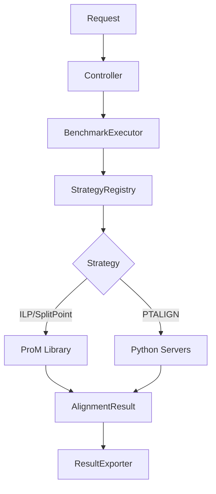
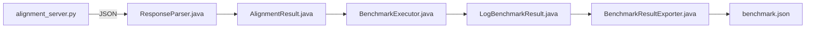
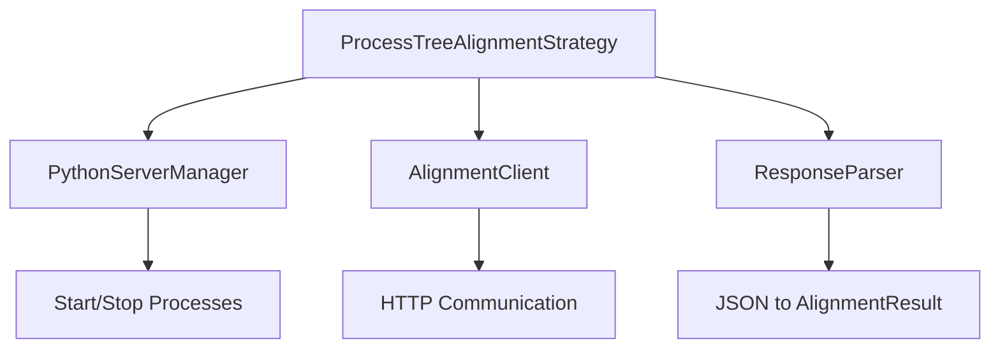

# Backend: Spring Boot

Java REST API for benchmark orchestration. Handles ILP/SPLITPOINT alignments directly via ProM, delegates PTALIGN to Python servers.

## Overview

| Property | Value |
|----------|-------|
| Port | 8080 |
| Base URL | http://localhost:8080/api/benchmark |
| Purpose | Orchestrate alignment benchmarks across multiple algorithms |

## Package Structure

```
com.benchmarktool.api/
├── controller/
│   └── BenchmarkingController.java
├── model/
│   ├── BenchmarkRequest.java
│   ├── BenchmarkResult.java
│   └── LogBenchmarkResult.java
├── service/
│   ├── BenchmarkExecutor.java
│   ├── BenchmarkResultExporter.java
│   └── ResultCache.java
└── util/strategy/
    ├── AlignmentStrategy.java
    ├── AlignmentStrategyRegistry.java
    ├── AlignmentInput.java
    ├── AlignmentResult.java
    ├── TimingBreakdown.java
    ├── TraceAlignmentDetail.java
    ├── ModelType.java
    ├── ILPAlignmentStrategy.java
    ├── SplitPointAlignmentStrategy.java
    ├── ProcessTreeAlignmentStrategy.java
    └── ptalign/
        ├── PythonServerManager.java
        ├── AlignmentClient.java
        └── ResponseParser.java
```

## Request Flow



## PTALIGN Data Flow



## Fitness Calculation

Fitness is calculated in the Python backend.
To switch formulas, change the function name at call sites in align_variants.
The shortest_path_cost is the minimum number of labeled transitions from source to sink in the process tree graph. For models where empty traces are valid, this value is 0.

## Adding a New Algorithm

### Java-based Algorithm


Create the strategy class in util/strategy/:

```java name=NewAlgorithmStrategy.java
package com.benchmarktool.api.util.strategy;

import org.springframework.stereotype.Component;

@Component
public class NewAlgorithmStrategy implements AlignmentStrategy {

    @Override
    public ModelType getModelType() {
        return ModelType.PETRI_NET;
    }

    @Override
    public AlignmentResult computeAlignment(AlignmentInput input) throws Exception {
        long startTime = System.currentTimeMillis();
        
        // alignment logic here
        
        long executionTime = System.currentTimeMillis() - startTime;
        
        return AlignmentResult.builder()
            .totalTraces(input.getLog().size())
            .avgFitness(1.0)
            .avgCost(0.0)
            .executionTimeMs(executionTime)
            .build();
    }

    @Override
    public String getName() {
        return "NEW_ALGORITHM";
    }

    @Override
    public String getDescription() {
        return "Description of the algorithm";
    }
}
```

The Component annotation ensures Spring auto-discovers and registers it.

### External Service Algorithm



See ProcessTreeAlignmentStrategy.java as a reference implementation.

## Key Interfaces

### AlignmentStrategy

```java
public interface AlignmentStrategy {
    ModelType getModelType();
    AlignmentResult computeAlignment(AlignmentInput input) throws Exception;
    String getName();
    String getDescription();
}
```

### ModelType

```java
public enum ModelType {
    PETRI_NET("pnml"),
    PROCESS_TREE("ptml");
}
```

The ModelType determines which model file path the executor looks for in the request.

## Exported JSON Structure
Results are exported to data/dataset/results/benchmark_id_algorithm_model_n_logs.json

```json
{
  "benchmarkId": "20c7e96f-b8cf-42b9-8040-c0ff94db2e2b",
  "algorithm": "PTALIGN",
  "modelFile": "Sepsis_Cases_25.ptml",
  "logName": "Sepsis_Cases",
  "logDirectory": "Sepsis_Cases_random_variant_split_3",
  "logCount": 3,
  "numThreads": 1,
  "timestamp": "20260305_144209",
  "summary": {
    "avgFitness": 0.789147,
    "avgCost": 2.546270,
    "successfulAlignments": 846,
    "failedAlignments": 0,
    "totalTraces": 1050,
    "totalVariants": 846,
    "totalLogsProcessed": 3,
    "totalExecutionTimeMs": 67817,
    "totalComputeTimeMs": 58936,
    "peakMemoryMb": 118
  },
  "ptalignConfig": {
    "propagateCosts": false,
    "useBounds": false,
    "useWarmStart": false
  },
  "logs": {
    "random_variant_split_0": { ... },
    "random_variant_split_1": {
      "totalTraces": 396,
      "totalVariants": 282,
      "successfulAlignments": 282,
      "failedAlignments": 0,
      "avgFitness": 0.707516,
      "avgCost": 2.825758,
      "shortestPathCost": 0.0,
      "executionTimeMs": 23075,
      "memoryUsedMb": 1,
      "timing": {
        "totalMs": 23075,
        "computeMs": 20077,
        "overheadMs": 2998,
        "parseMs": 315,
        "networkMs": 2683,
        "efficiency": 0.870
      },
      "optimizationStats": {
        "fullAlignments": 282,
        "warmStartAlignments": 0,
        "boundedSkips": 0,
        "cachedAlignments": 0,
        "optimizationRate": 0.0
      },
      "alignments": [
        {
          "variantName": ["ER Registration", "Leucocytes", ...],
          "alignmentCost": 2.0,
          "fitness": 0.85,
          "traceLength": 12,
          "traceCount": 1,
          "alignmentTimeMs": 67,
          "statesExplored": 0,
          "method": "full",
          "lowerBound": 3.0,
          "upperBound": 8.0,
          "confidence": 1.0
        },
        ...
      ],
      "boundsProgression": [
        {
          "variantIndex": 115,
          "numReferences": 0,
          "lowerBound": 0.0,
          "actualCost": 2.0,
          "method": "full"
        },
        {
          "variantIndex": 0,
          "numReferences": 1,
          "lowerBound": 0.0,
          "upperBound": 10.0,
          "gap": 10.0,
          "actualCost": 3.0,
          "method": "full"
        },
        {
          "variantIndex": 2,
          "numReferences": 3,
          "lowerBound": 0.0,
          "upperBound": 27.0,
          "gap": 27.0,
          "estimatedCost": 27.0,
          "method": "bounded_skip"
        },
        ...
      ],
      "globalBoundsProgression": [
        {
          "numReferences": 1,
          "numRemaining": 281,
          "meanLowerBound": 1.2,
          "meanUpperBound": 8.5,
          "meanGap": 7.3,
          "minGap": 0.5,
          "maxGap": 15.0,
          "numSkippable": 45
        },
        ...
      ]
    }
  }
}
```

The boundsProgression and globalBoundsProgression arrays are only present when bounds-based optimization is enabled. Each log entry in logs contains one entry per processed log file.


## Configuration

Edit src/main/resources/application.properties:

```properties
server.port=8080
server.servlet.context-path=/api
benchmark.data.directory=../data
```

## Setup

See [backend-springboot/README.md](../../backend-springboot/README.md) for further instructions and installation. 