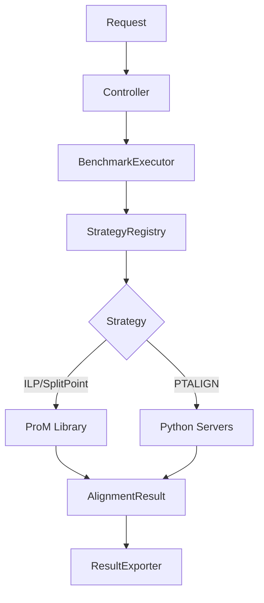

# Backend: Spring Boot

Java REST API for benchmark orchestration. Handles ILP/SPLITPOINT alignments directly via ProM, delegates PTALIGN to Python servers.

## Overview

| Property | Value |
|----------|-------|
| Port | 8080 |
| Base URL | `http://localhost:8080/api/benchmark` |
| Purpose | Orchestrate alignment benchmarks across multiple algorithms |

## Package Structure

```
com.benchmarktool.api/
├── controller/
│   └── BenchmarkingController.java    # REST endpoints
├── service/
│   ├── BenchmarkExecutor.java         # Runs benchmarks
│   ├── BenchmarkResultExporter.java   # Exports results to JSON
│   └── ResultCache.java               # Caches async results
└── util/strategy/
    ├── AlignmentStrategy.java         # Strategy interface
    ├── AlignmentStrategyRegistry.java # Auto-discovers strategies
    ├── AlignmentInput.java            # Input wrapper
    ├── AlignmentResult.java           # Unified result format
    ├── ModelType.java                 # PETRI_NET or PROCESS_TREE
    ├── ILPAlignmentStrategy.java      # ProM ILP
    ├── SplitPointAlignmentStrategy.java # ProM SplitPoint
    ├── ProcessTreeAlignmentStrategy.java # Python PTALIGN
    └── ptalign/
        ├── PythonServerManager.java   # Manages Python processes
        ├── AlignmentClient.java       # HTTP client
        └── ResponseParser.java        # JSON parsing
```

## How It Works



1. Request arrives with algorithm name and file paths
2. `BenchmarkExecutor` gets the strategy from `AlignmentStrategyRegistry`
3. Strategy computes alignment (either via ProM or Python)
4. Results are converted to unified `AlignmentResult` format
5. Results are cached and optionally exported to JSON

## Adding a New Alignment Algorithm

### Case 1: Java-based algorithm (simple)

For algorithms that run in-process (like ProM-based).

**Step 1:** Create the strategy class in `util/strategy/`:

```java name=NewAlgorithmStrategy.java
package com.benchmarktool.api.util.strategy;

import org.springframework.stereotype.Component;

@Component
public class NewAlgorithmStrategy implements AlignmentStrategy {

    @Override
    public ModelType getModelType() {
        return ModelType.PETRI_NET;  // or PROCESS_TREE
    }

    @Override
    public AlignmentResult computeAlignment(AlignmentInput input) throws Exception {
        long startTime = System.currentTimeMillis();
        
        // Your alignment logic here
        // Use input.getLog(), input.getPetriNet(), etc.
        
        long executionTime = System.currentTimeMillis() - startTime;
        
        return AlignmentResult.builder()
            .totalTraces(input.getLog().size())
            .avgFitness(1.0)
            .avgCost(0.0)
            .executionTimeMs(executionTime)
            .build();
    }

    @Override
    public String getName() {
        return "NEW_ALGORITHM";
    }

    @Override
    public String getDescription() {
        return "Description of the algorithm";
    }
}
```

**Step 2:** Done. The `@Component` annotation ensures Spring auto-discovers and registers it.

Verify by calling:
```
GET /api/benchmark/algorithms
```

### Case 2: External service algorithm (advanced)

For algorithms that run in a separate process (like PTALIGN with Python/Gurobi).

This is more complex. See `ProcessTreeAlignmentStrategy.java` as a reference. You'll need:

- Server lifecycle management (start/stop processes)
- HTTP client for communication
- Response parsing
- Error handling and retries

Key classes to study:
- `util/strategy/ptalign/PythonServerManager.java` - Process management
- `util/strategy/ptalign/AlignmentClient.java` - HTTP communication
- `util/strategy/ptalign/ResponseParser.java` - JSON to `AlignmentResult`

## Key Interfaces

### AlignmentStrategy

```java
public interface AlignmentStrategy {
    ModelType getModelType();
    AlignmentResult computeAlignment(AlignmentInput input) throws Exception;
    String getName();
    String getDescription();
}
```

### ModelType

```java
public enum ModelType {
    PETRI_NET("pnml"),    // .pnml files
    PROCESS_TREE("ptml"); // .ptml files
}
```

The `ModelType` determines which model file path the executor looks for in the request.

## Configuration

`src/main/resources/application.properties`:

```properties
server.port=8080
server.servlet.context-path=/api
benchmark.data.directory=../data
```

## Setup

See [backend-springboot/README.md](../../backend-springboot/README.md) for installation and running instructions.