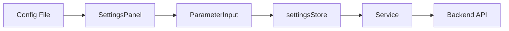

# Frontend: Electron

Desktop UI built with Electron, React, and TypeScript. Uses a config-driven approach where algorithm definitions drive the UI automatically.

## Overview

| Property | Value |
|----------|-------|
| Dev Port | 5173 (Vite) |
| Framework | Electron + React 19 |
| State | Zustand (persisted to localStorage) |
| Styling | Tailwind CSS + shadcn/ui |

## Project Structure

```
frontend-electron/
├── electron/
│   ├── main.ts                 # Electron main process
│   └── preload.ts              # IPC bridge
├── src/
│   ├── config/
│   │   ├── benchmarkAlgorithms.ts    # Benchmark algorithm definitions
│   │   └── clusteringAlgorithms.ts   # Clustering algorithm definitions
│   ├── components/
│   │   ├── settings/
│   │   │   ├── BenchmarkingSettingsPanel.tsx
│   │   │   ├── ClusteringSettingsPanel.tsx
│   │   │   └── ParameterInput.tsx    # Generic parameter renderer
│   │   └── ui/                       # shadcn/ui components
│   ├── services/
│   │   ├── benchmarkingService.ts    # Spring Boot API client
│   │   └── clusteringService.ts      # Flask API client
│   ├── stores/
│   │   └── settingsStore.ts          # Zustand state
│   ├── views/
│   │   ├── DashboardView.tsx         # File explorer + actions
│   │   ├── SettingsView.tsx          # Configuration panels
│   │   └── BenchmarkView.tsx         # Results display
│   └── App.tsx
└── package.json
```

## Config-Driven UI

The settings panels render automatically from config files. No UI code changes needed when adding algorithms.



## Adding a New Clustering Algorithm

**One file to edit:** `src/config/clusteringAlgorithms.ts`

Add an entry to `CLUSTERING_ALGORITHMS`:

```typescript
export const CLUSTERING_ALGORITHMS: Record<string, ClusteringAlgorithm> = {
  // ... existing algorithms ...
  
  kmeans: {
    id: 'kmeans',
    name: 'K-Means',
    description: 'Centroid-based clustering',
    parameters: [
      {
        key: 'n_clusters',
        label: 'Number of Clusters',
        type: 'number',
        min: 2,
        max: 20,
        default: 3,
        description: 'Number of clusters to create',
      },
      {
        key: 'max_iter',
        label: 'Max Iterations',
        type: 'number',
        min: 100,
        max: 1000,
        default: 300,
      },
    ],
  },
};
```

The UI will automatically:
- Show the algorithm in the dropdown
- Render parameter inputs based on `type`
- Respect `condition` functions for conditional visibility
- Persist values to localStorage via Zustand

### Parameter Types

| Type | Renders | Properties |
|------|---------|------------|
| `number` | Numeric input | `min`, `max`, `step` |
| `select` | Dropdown | `options: [{value, label}]` |
| `toggle` | Checkbox | - |
| `slider` | Range slider | `min`, `max`, `step` |
| `text` | Text input | - |

### Conditional Parameters

Use `condition` to show/hide parameters based on other values:

```typescript
{
  key: 'distance_threshold',
  label: 'Distance Threshold',
  type: 'number',
  default: 10,
  condition: (params) => params.useDistanceThreshold === true,
}
```

## Adding a New Benchmark Algorithm

**One file to edit:** `src/config/benchmarkAlgorithms.ts`

Add an entry to `BENCHMARK_ALGORITHMS`:

```typescript
export const BENCHMARK_ALGORITHMS: Record<string, BenchmarkAlgorithm> = {
  // ... existing algorithms ...
  
  NEW_ALGO: {
    id: 'NEW_ALGO',
    name: 'New Algorithm',
    description: 'Description here',
    modelType: 'pnml',  // or 'ptml'
    parameters: [
      // Same parameter structure as clustering
    ],
  },
};
```

The `modelType` determines which model file selector is shown:
- `pnml` → Petri Net file required
- `ptml` → Process Tree file required

## Services

### clusteringService.ts

Calls Flask backend at `localhost:5000`:

```typescript
clusteringService.clusterFile({
  file_path: '/path/to/log.xes',
  clustering_algorithm: 'hierarchical',
  algorithm_params: { n_clusters: 3, linkage: 'average' }
})
```

### benchmarkingService.ts

Calls Spring Boot backend at `localhost:8080`:

```typescript
benchmarkingService.startBenchmark({
  algorithm: 'PTALIGN',
  ptmlModelPath: '/path/to/model.ptml',
  logDirectory: '/path/to/logs/',
  numThreads: 4,
  // ... PTALIGN-specific params
})
```

## State Management

Zustand store with localStorage persistence:

```typescript
// Read
const { clustering, benchmarking } = useSettingsStore();

// Write
setClusteringSettings({ algorithm: 'dbscan', params: { eps: 5 } });
setBenchmarkingSettings({ selectedAlgorithms: ['ILP', 'PTALIGN'] });
```

Settings survive page reloads and app restarts.

## Views

| View | Purpose |
|------|---------|
| `DashboardView` | File explorer, actions panel, console |
| `SettingsView` | Clustering and benchmark configuration |
| `BenchmarkView` | Run benchmarks, view results, compare |

## Setup

See [frontend-electron/README.md](../../frontend-electron/README.md) for installation.