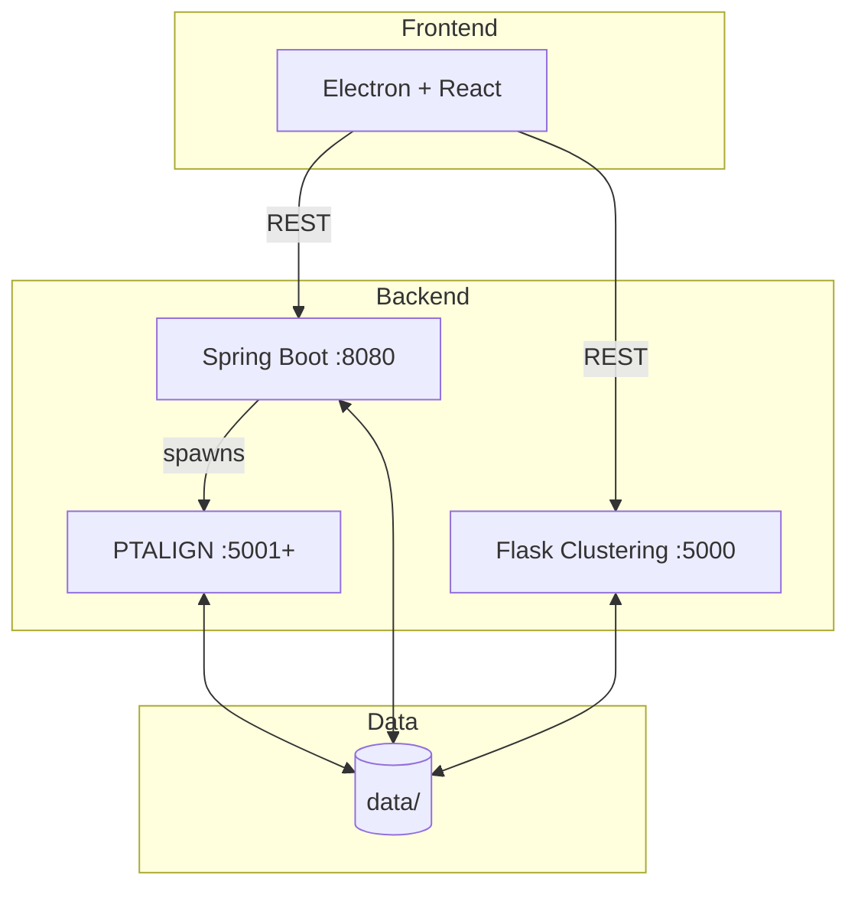
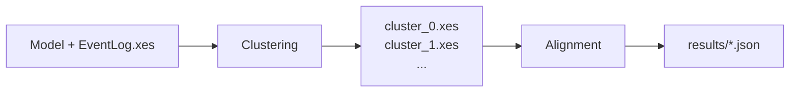

# Developer Guide

Quick reference for developers working on ccBenchmarkTool.

## System Overview

## Components

| Component | Tech Stack | Port | Purpose |
|-----------|------------|------|---------|
| frontend-electron | Electron + React + TS | 5173 | Desktop UI |
| backend-springboot | Java 21 + Spring Boot | 8080 | Benchmark orchestration |
| backend-flask | Python + Flask | 5000 | Trace clustering |
| backend-alignment | Python + Gurobi | 5001+ | PTALIGN alignment |

## Alignment Algorithms

| Algorithm | Model | Implementation |
|-----------|-------|----------------|
| ILP | Petri Net (.pnml) | Java/ProM |
| SPLITPOINT | Petri Net (.pnml) | Java/ProM |
| PTALIGN | Process Tree (.ptml) | Python/Gurobi |

## Data Flow

## Adding New Algorithms

### Spring Boot (Java-based)

1. Create class implementing `AlignmentStrategy`
2. Annotate with `@Component`
3. Done (auto-discovered)

See [backend-springboot.md](components/backend-springboot.md)

### Flask Clustering

1. Create class extending `BaseClusterer`
2. Add to `CLUSTERERS` dict in `__init__.py`

See [backend-flask.md](components/backend-flask.md)

## Component Documentation

- [backend-springboot](components/backend-springboot.md) - Benchmark orchestration
- [backend-alignment](components/backend-alignment.md) - PTALIGN algorithm
- [backend-flask](components/backend-flask.md) - Clustering service
- [frontend-electron](components/frontend-electron.md) - Desktop UI

## API Reference

See [api-reference.md](api-reference.md) for all endpoints and data types.